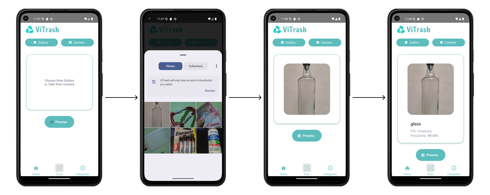
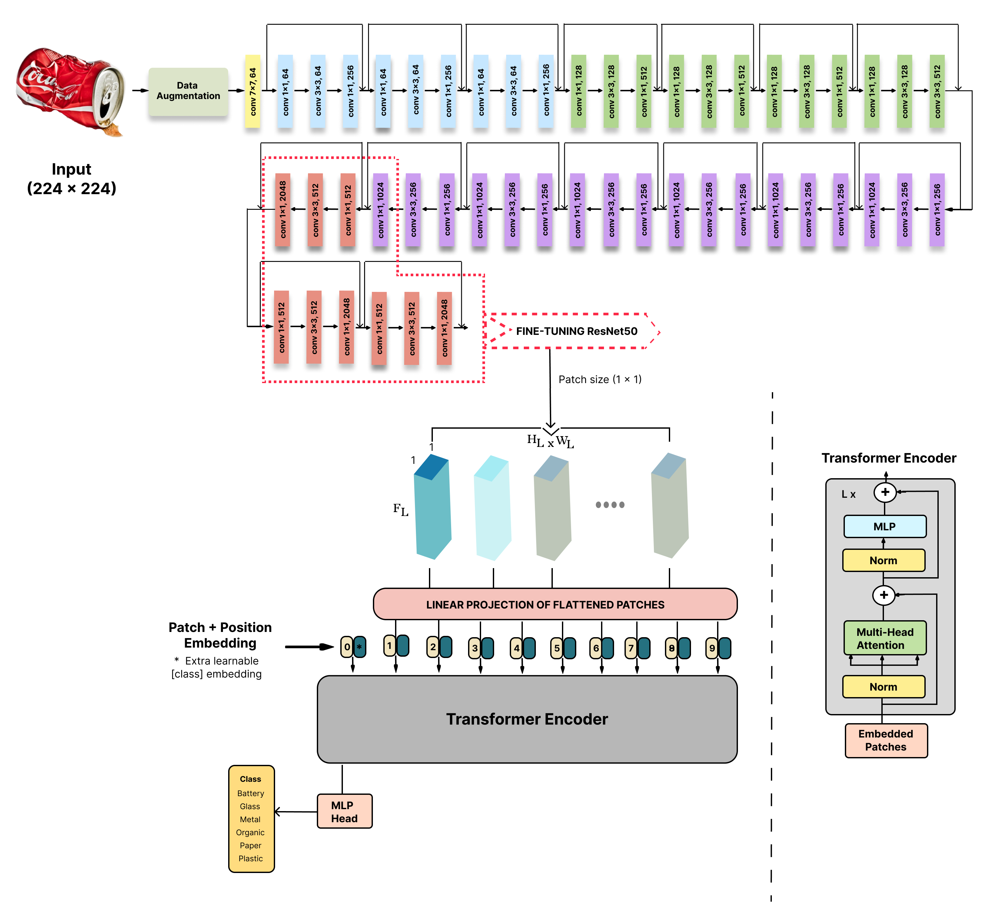
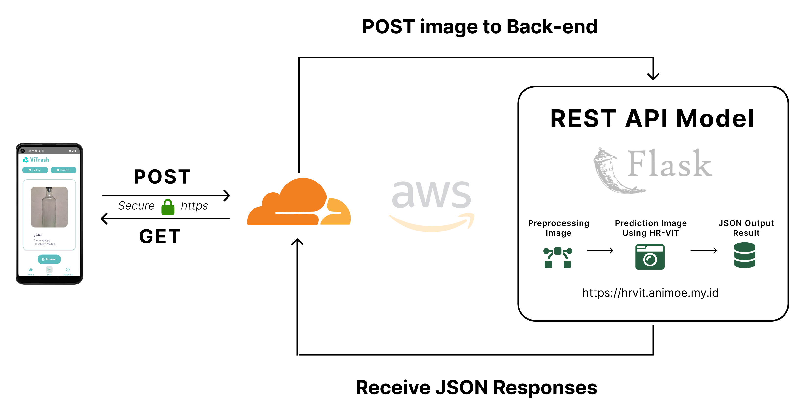

# HR-ViT: A Hybrid Vision Transformer Model for Efficient Waste Classification

<p align="center">
  
</p>

## Overview

This repository contains the official implementation associated with our research paper "A Hybrid Vision Transformer Model for Efficient Waste Classification" published in Jurnal Ilmu Komputer dan Informasi. Our model combines Vision Transformers with a ResNet-50 backbone to classify waste materials into six categories: battery, glass, metal, organic, paper, and plastic.

[](https://doi.org/10.21609/jiki.v18i2.1545)
[](./dataset/modified_dataset.rar)

## Repository Structure

```
📦 HR-ViT
 ┣ 📂 model              # Jupyter Notebook for HR-ViT model development
 ┣ 📂 back-end           # Flask API for waste classification
 ┣ 📂 dataset            # dataset
 ┗ 📂 mobile-app         # React Native mobile application
 
```

## Components

### 1. Model: Hybrid ResNet-Vision Transformer

This component demonstrates the research and development of our Hybrid ResNet-Vision Transformer (HR-ViT) model:

- **Data preparation**: Processing and augmentation of waste image datasets
- **Model architecture**: Implementation of Vision Transformer with ResNet-50 backbone
- **Training pipeline**: Complete training process with validation and testing
- **Performance analysis**: Confusion matrices, classification reports, and accuracy metrics
- **Misclassification analysis**: Visualization of errors and edge cases

The notebooks provide a comprehensive understanding of our machine learning workflow from data exploration to model evaluation.

### 2. Back-end API

Our Flask backend provides a production-ready API for the trained HR-ViT model:

- **RESTful API endpoints** for waste classification
- **Efficient model inference** with optimized preprocessing
- **File upload handling** for image processing
- **Error handling and validation**
- **Comprehensive logging system**

Key endpoints include:
- `/health` - Health check
- `/predict` - Image classification
- `/upload` - Batch prediction
- `/class_names` - Available categories
- `/status` - Model status
- `/logs` - System logs

### 3. Mobile Application

The React Native mobile application (ViTrash) provides an intuitive interface for waste classification:

- **Camera integration** for capturing waste items
- **Gallery access** for existing images
- **Real-time classification** with confidence scores
- **Educational content** about different waste categories

<p align="center">
  
</p>

The mobile application demonstrates a seamless user experience, allowing users to easily capture waste images and receive instant classification results with confidence scores, as shown in the workflow above.

## Getting Started

### Model Development

1. Navigate to the `model` directory
2. Open the notebooks in Jupyter Lab or Google Colab
3. Run the cells sequentially to replicate our experiments

### Backend API

1. Navigate to the `back-end` directory
2. Install dependencies: `pip install -r requirements.txt`
3. Place the trained model file in the `/model` directory
4. Start the server: `flask run` or `gunicorn main:create_app`

### Mobile Application

1. Navigate to the `mobile-app` directory
2. Install dependencies: `npm install` or `yarn install`
3. Start the development server: `npm start` or `yarn start`
4. Run on Android: `npm run android` or iOS: `npm run ios`

## Technical Details

### HR-ViT Model Architecture

<p align="center">
  
</p>

Our Hybrid Vision Transformer (HR-ViT) combines the strengths of CNNs and Transformers:

- **ResNet-50 backbone** extracts hierarchical features from images
- **Custom patching layer** transforms feature maps into sequence tokens
- **Position embeddings** maintain spatial information
- **Transformer encoder** with multi-head self-attention processes the tokens
- **Classification head** performs the final six-class categorization

The model achieves strong performance across all waste categories while maintaining efficient inference time suitable for mobile applications.

### Deployment Architecture

<p align="center">
  
</p>

Our system utilizes a client-server architecture where:

1. The mobile application captures waste images through camera or gallery selection
2. Images are sent securely via HTTPS POST requests to our AWS-hosted backend
3. The Flask-based REST API preprocesses images and applies our HR-ViT model for prediction
4. Classification results are returned as JSON responses with class names and confidence scores
5. The mobile app displays the results to users in a user-friendly interface

This architecture ensures efficient processing, scalability, and a responsive user experience across different devices.

## Technologies Used

- **Python 3.9+** for model development and backend
- **TensorFlow 2.10** for deep learning implementation
- **Flask** for API development
- **React Native** for mobile application
- **JavaScript** for frontend logic

## 📚 Citation

If you use this code or the findings in your research, please cite our paper:

```bibtex
@article{HR-ViT,
  title={A Hybrid Vision Transformer Model for Efficient Waste Classification},
  volume={18},
  url={https://jiki.cs.ui.ac.id/index.php/jiki/article/view/1545},
  DOI={10.21609/jiki.v18i2.1545},
  number={2},
  journal={Jurnal Ilmu Komputer dan Informasi},
  author={Amir Mahmud Husein and Baren Baruna Harahap and Tio Fulalo Simatupang and Karunia Syukur Baeha and Bintang Keitaro Sinambela},
  year={2025},
  month={Jun.},
  pages={261–275}
}
```

## License

This project is made available for academic research purposes with all rights reserved. Commercial usage requires explicit permission from the authors.

## Contact

For questions or collaborations regarding this research, please contact the corresponding author.
